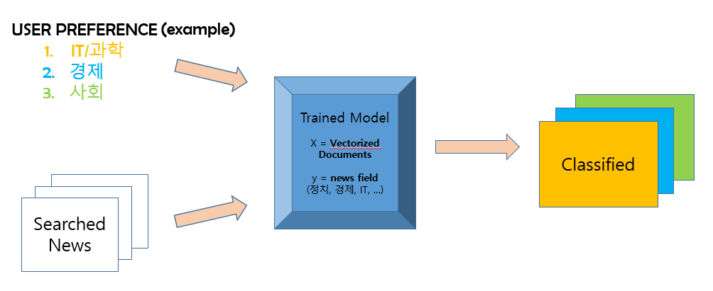

# News Rank system with NLP classification
> ### Provide list of seached news based on user's preference

- **Tools**
  - Selenium, Naver API
  - Scikit-learn, KoNLPy
  - Flask, AWS
  - MySQL

  
## Data Collection + Model Training

## News Rank

## AWS, flask와 연동
> #### 0. 데이터 수집부터 뉴스랭크까지 모듈화하여 flask와 연결
> #### 1. 검색어 입력 페이지 작성 후 flask와 연결
> #### 2. 위 둘을 AWS에 올림
> #### 3. 실제 유저들에 대한 데이터가 없으므로 Seed를 사용