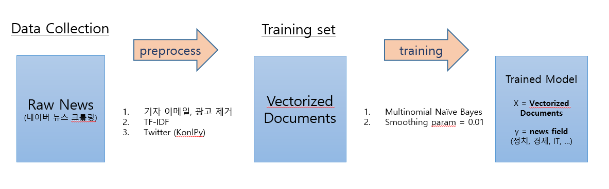

# 자연어처리 분류모델을 이용한 뉴스랭크 시스템
> 유저가 특정 키워드로 뉴스검색 시 자주 보던 분야 순으로 검색결과 제공

## How it works
> #### 0. 데이터 수집

> #### 1. 모델훈련

> #### 2. 뉴스검색 + 뉴스랭크

> #### 3. AWS, flask와 연동

-----------------

## 데이터 수집
> #### 0. X = TF-IDF된 뉴스, y = 뉴스분야 (정치, 세계, etc..)

> #### 1. training set = 네이버 뉴스 (셀레니움 크롤링)

> #### 2. test set = training set보다 최신의 네이버 뉴스 (셀레니움 크롤링)

> #### 3. 크롤링한 뉴스에 대해 전처리 (기자 이메일, 각종 광고문구 제거 etc)

> #### 4. 전처리된 뉴스들을 MySQL에 저장

## 모델훈련
> #### 0. DB에서 뉴스 불러옴
> #### 1. Multinomial Naive Bayes + TF-IDF + Twitter tagger로 훈련
> #### 2. CV 수행하여 confusion matrix, clf report로 overfitting됬는지 확인하고 결과저장
> #### 3. test set을 이용하여 performance check
> #### 4. 훈련된 모델 pickle로 저장

## 뉴스검색 + 뉴스랭크
> #### 0. 유저로부터 웹에서 키워드를 입력받음	
> #### 1. 네이버 api 사용하여 뉴스검색
> #### 2. 모델 pickle로 불러온 후 전처리된 뉴스의 분야분류
> #### 3. 유저가 자주 보던 분야 순으로 검색결과제공

## AWS, flask와 연동
> #### 0. 데이터 수집부터 뉴스랭크까지 모듈화하여 flask와 연결
> #### 1. 검색어 입력 페이지 작성 후 flask와 연결
> #### 2. 위 둘을 AWS에 올림
> #### 3. 실제 유저들에 대한 데이터가 없으므로 Seed를 사용

## To do list
1. 웹 페이지에서 실제 activiy를 기록하여 유저가 어떤 분야를 보는지 check
2. Multinomial NB가 아닌 NLP Deep learning을 사용하여 모델링
3. ERD, Table Schema
4. PPT로 도식화 맨 위에 붙이기