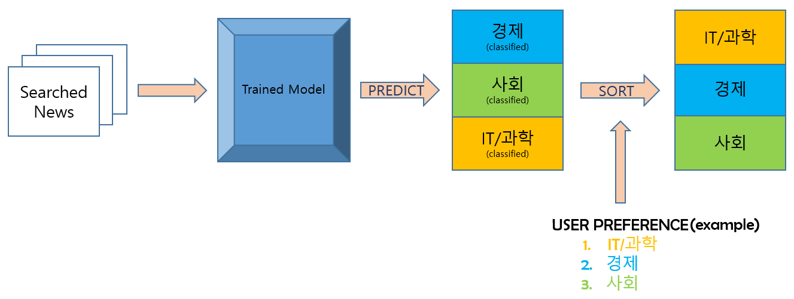

# News Rank system with NLP classification
> ### Provide list of seached news based on user's preference

- What i did
	> ### Data Collection + Model Training
	> ### News Rank
	> ### Associate with Flask + AWS

- **Tools**
  - Selenium, Naver API
  - Scikit-learn, KoNLPy
  - Flask, AWS
  - MySQL

  
## Data Collection + Model Training

## News Rank

## Associate with Flask + AWS

## Performance

|           	| precision 	| recall 	| F1-Score 	| support 	|
|:---------:	|-----------	|--------	|----------	|---------	|
| 0         	| 0.92      	| 0.94   	| 0.93     	| 975     	|
| 1         	| 0.88      	| 0.89   	| 0.88     	| 958     	|
| 2         	| 0.93      	| 0.89   	| 0.91     	| 958     	|
| 3         	| 0.95      	| 0.93   	| 0.94     	| 943     	|
| 4         	| 0.93      	| 0.93   	| 0.93     	| 971     	|
| 5         	| 0.93      	| 0.94   	| 0.94     	| 916     	|
| avg/total 	| 0.92      	| 0.92   	| 0.92     	| 5721    	|

