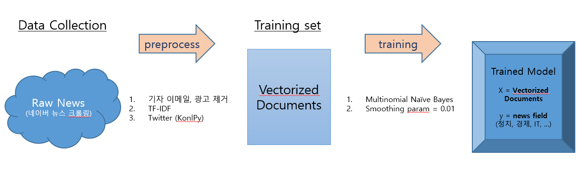

# News Rank system with NLP classification
> ### Provide list of seached news based on user's preference

- **Tools**
  - Selenium, Naver API
  - Scikit-learn, KoNLPy
  - Flask, AWS
  - MySQL

  
## Data Collection + Model Training

## News Rank

## Associate with Flask + AWS

